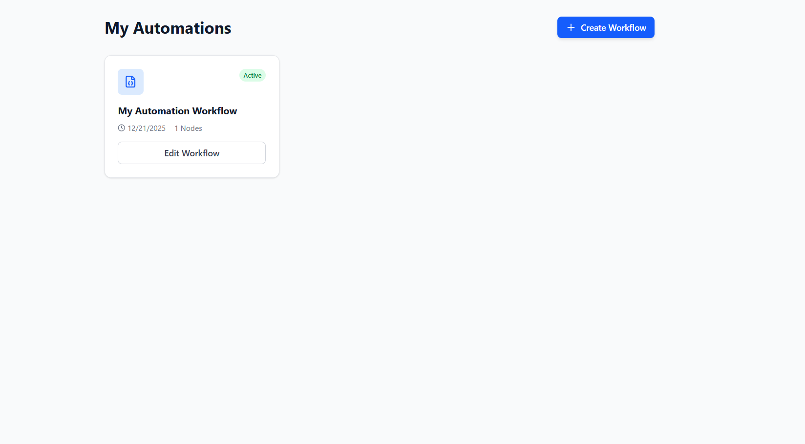
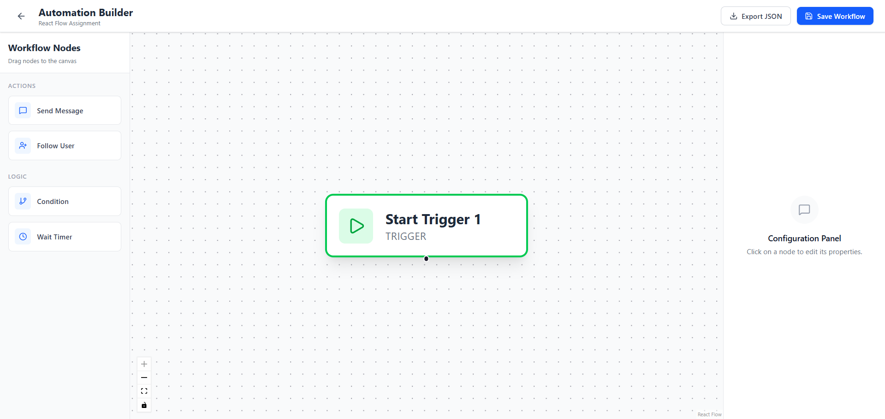

# ⚡ Zap-Lite | Automation Workflow Builder

**Zap-Lite** is a modern, visual automation workflow builder inspired by tools like Zapier and Make.com. Built with **React** and **React Flow**, it allows users to design linear automation flows via a drag-and-drop interface, configure node properties, and export workflows as JSON.




## 🚀 Features

### 🎨 Visual Workflow Builder

- **Drag & Drop Interface:** Easily drag nodes from the sidebar onto the infinite canvas.
- **Interactive Nodes:** Custom-styled nodes for Triggers, Actions, and Logic.
- **Zoom & Pan:** Full canvas navigation controls.



### 🧩 Node Types

- **Start Trigger:** The entry point of every workflow.
- **Actions:** "Send Message" and "Follow User" nodes.
- **Logic:** "Condition" nodes for branching logic.
- **Timing:** "Wait Timer" to add delays.

### ⚙️ Configuration & State

- **Dynamic Settings Panel:** Click any node to edit its specific properties (e.g., Message text, Wait duration) in the right sidebar.
- **State Management:** Powered by **Zustand** using atomic selectors for high-performance state updates without re-renders.

### 🛡️ Validation & Persistence

- **Linear Workflow Enforcement:** Restricts nodes to one outgoing edge to ensure linear flows.
- **Data Validation:** Prevents saving if required fields (like phone numbers) are empty.
- **Save & Export:** Save workflows to LocalStorage or export them as JSON files.

---

## 🛠️ Tech Stack

- **Core:** [React.js](https://react.dev/) (Vite)
- **Styling:** [Tailwind CSS](https://tailwindcss.com/)
- **Diagramming:** [React Flow](https://reactflow.dev/)
- **State Management:** [Zustand](https://github.com/pmndrs/zustand)
- **Icons:** [Lucide React](https://lucide.dev/)
- **Routing:** React Router DOM
- **Utilities:** clsx, tailwind-merge, uuid

---

## 📂 Project Structure

```text
src/
├── components/
│   ├── layout/          # Sidebar, Header, and Page Layouts
│   ├── nodes/           # Custom React Flow Node Components
│   ├── panels/          # Configuration/Settings Panel
│   └── ui/              # Reusable UI elements
├── constants/           # Node types and initial data
├── hooks/               # Custom React hooks
├── lib/                 # Utilities (Validation, ID generation)
├── pages/               # Dashboard and Builder pages
├── store/               # Zustand Global Store
└── App.jsx              # Main Entry & Routing
```
